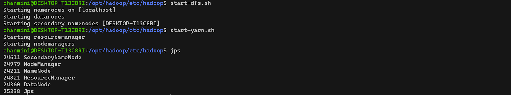

# Chicago Crime Pattern Analytics with MapReduce  
## University of Ruhuna - Faculty of Engineering 
### Module Name: Cloud Computing (EC7205)  
### Assignment 1
### Group Number: 55

---

## Team Members
- EG/2020/3943 - Sundarasekara G.O.
- EG/2020/3978 - Jayakody J.A.T.K.
- EG/2020/4181 - Samaraweera S.A.D.C.K.
---

## Table of Contents

1. [Dataset](#1-chosen-dataset)
2. [MapReduce Job Implementation](#2-mapreduce-job-implementation)
3. [Environment Setup](#3-environment-setup)
4. [Test and Run on Real Data](#4-test-and-run-on-real-data)
5. [Result Interpretation](#5-result-interpretation)
6. [Source Code](#6-source-code)
---

## 1. Dataset

This project uses the [chicago crimes 2023-2024](https://www.kaggle.com/datasets/carolinaaaaaaa/chicago-crimes-90-days-2024) dataset from Kaggle, containing one year's worth of police reports, covering the period from **2023-05-05 to 2024-05-03**. The data contains detailed records of reported crimes in the city of Chicago over this time frame.

- **Time Period:** One year, from 2023-05-05 to 2024-05-03.
- **Rows:** 258535 records.
- **Format:** CSV file with columns:

  - `CASE#`
  - `DATE  OF OCCURRENCE`
  - `BLOCK`
  - `IUCR`
  - `PRIMARY DESCRIPTION`
  - `SECONDARY DESCRIPTION`
  - `LOCATION DESCRIPTION`
  - `ARREST`
  - `DOMESTIC`
  - `BEAT`
  - `WARD`
  - `FBI CD`
  - `X COORDINATE`
  - `Y COORDINATE`
  - `LATITUDE`
  - `LONGITUDE`
  - `LOCATION`
- **Reason for choice:** The dataset is sufficiently large, real-world, and complex, enabling meaningful crime analytics at scale.

#### Example row

---

| CASE#    | DATE OF OCCURRENCE | BLOCK               | IUCR | PRIMARY DESCRIPTION | SECONDARY DESCRIPTION | LOCATION DESCRIPTION | ARREST |
|----------|--------------------|---------------------|------|--------------------|----------------------|---------------------|--------|
| JG497095 | 11/8/2023 20:50    | 025XX N KEDZIE BLVD | 810  | THEFT              | OVER $500            | STREET              | N      |

---

| DOMESTIC | BEAT | WARD | FBI CD | X COORDINATE | Y COORDINATE | LATITUDE     | LONGITUDE     | LOCATION                    |
|----------|------|------|--------|--------------|--------------|--------------|---------------|-----------------------------|
| N        | 1414 | 35   | 6      | 1154609      | 1916759      | 41.92740733  | -87.70729439  | (41.927407329, -87.70729439) |

</br>

---

## 2. MapReduce Job Implementation

**Task Chosen:**  
Analyze and summarize Chicago crime patterns by:
- Counting the number of crimes per combination of crime category and location.
- Identifying the most common locations for each crime type.

**MapReduce Approach:**

- **Mapper (`src/mapper.py`):**  
  Reads CSV rows, extracts the primary crime description and location, and emits key-value pairs of the form:  
  `<crime_type> <TAB> <location> <TAB> 1`

- **Reducer (`src/reducer.py`):**  
  Receives sorted key-value pairs, aggregates the counts for each (crime_type, location) pair, and outputs the total count for each unique combination.

- **Interpretation Script (`src/interpret_results.py`):**  
  Reads the reducer's output and:
    - Computes and prints the total number of crimes per crime type.
    - For each crime type, identifies the top 3 locations where that crime most frequently occurs.

**Example Output:**  
- List of crime types sorted by total reports.
- For each crime type, a list of the three most common locations and the number of reports at each.

This approach provides insights into which types of crimes are most frequent overall and where they are most likely to occur within Chicago.

**Programming Language:** Python (for both mapper and reducer scripts).

<div style="page-break-after: always;"></div>

---

## 3. Environment Setup

- **Platform:** Hadoop 3.4.1 (pseudo-distributed setup)
- **Java Version:** JDK 11
- **Python Version:** Python 3.x (used for mapper, reducer, and result interpretation scripts)
- **HDFS:** Configured for input/output storage.
- **Scripts:** Bash scripts automate upload, execution, and result interpretation. 

- **Evidence of installation:**  
  <br/>
  <b>Java Installation</b><br/>
  
  <br/>

  <b>Hadoop Installation</b><br/>
  
  <br/>

  <b>Environment Variables Configuration</b><br/>
  
  <br/>

  <b>Hadoop Configuration</b><br/>
    
    The Hadoop configuration files used for this project are available in the [hadoop-config](https://github.com/chanmini-kavinya/chicago-crime-mapreduce/tree/master/hadoop-config) 
    directory of the original GitHub repository:
    
  - [core-site.xml](https://github.com/chanmini-kavinya/chicago-crime-mapreduce/blob/master/hadoop-config/core-site.xml)
  - [hdfs-site.xml](https://github.com/chanmini-kavinya/chicago-crime-mapreduce/blob/master/hadoop-config/hdfs-site.xml)
  - [mapred-site.xml](https://github.com/chanmini-kavinya/chicago-crime-mapreduce/blob/master/hadoop-config/mapred-site.xml)
  - [yarn-site.xml](https://github.com/chanmini-kavinya/chicago-crime-mapreduce/blob/master/hadoop-config/yarn-site.xml) 

  <br/>

  <div style="page-break-after: always;"></div>

  <b>SSH Configuration</b><br/>
  
  
  
  <br/>

  <b>Start Hadoop Services</b><br/>
  

<div style="page-break-after: always;"></div>

---

## 4. Test and Run on Real Data

The MapReduce job was executed on the full Kaggle dataset (approximately one year of Chicago police reports).

- **Input:**  
  Full Kaggle Chicago crime dataset ([Kaggle Dataset Link](https://www.kaggle.com/datasets/carolinaaaaaaa/chicago-crimes-90-days-2024)).

- **Sample MapReduce Output ([output.txt](https://github.com/chanmini-kavinya/chicago-crime-mapreduce/blob/master/output/output.txt)):**
  ```
  ARSON	ABANDONED BUILDING	6
  ARSON	AIRPORT BUILDING NON-TERMINAL - NON-SECURE AREA	1
  ARSON	ALLEY	54
  ARSON	APARTMENT	78
  ARSON	BAR OR TAVERN	2
  ARSON	CHA APARTMENT	2
  ARSON	CHA HALLWAY / STAIRWELL / ELEVATOR	1
  ARSON	CHA PARKING LOT / GROUNDS	1
  ARSON	CHURCH / SYNAGOGUE / PLACE OF WORSHIP	1
  ARSON	COMMERCIAL / BUSINESS OFFICE	4
  ...
  ```

- **Sample Interpretation ([summary.txt](https://github.com/chanmini-kavinya/chicago-crime-mapreduce/blob/master/output/summary.txt)):**
  ```
  ==================================================
  Total Crime Types (Sorted by Count)
  ==================================================
  THEFT                               57531 crimes
  BATTERY                             44881 crimes
  CRIMINAL DAMAGE                     29816 crimes
  MOTOR VEHICLE THEFT                 26560 crimes
  ASSAULT                             22992 crimes
  ...

  ==================================================
  Top 3 Locations per Crime Type
  ===================================================

  🔹 THEFT (Top 3 Locations):
     1. STREET                    15215 reports
     2. APARTMENT                  7303 reports
     3. SMALL RETAIL STORE         4968 reports

  🔹 BATTERY (Top 3 Locations):
     1. APARTMENT                 14779 reports
     2. RESIDENCE                  6883 reports
     3. STREET                     6575 reports

  🔹 CRIMINAL DAMAGE (Top 3 Locations):
     1. STREET                    12079 reports
     2. APARTMENT                  5304 reports
     3. RESIDENCE                  3642 reports
  ```

<div style="page-break-after: always;"></div>

You can refer to the following files for the complete output and interpretation:
- [Raw MapReduce Output (output.txt)](https://github.com/chanmini-kavinya/chicago-crime-mapreduce/blob/master/output/output.txt)
- [Interpretation & Summary (summary.txt)](https://github.com/chanmini-kavinya/chicago-crime-mapreduce/blob/master/output/summary.txt)
---

## 5. Result Interpretation

### Crime Type Proportion


### Top 3 Locations per Crime Type


---

## 6. Source Code

The full source code is available at:  
[https://github.com/chanmini-kavinya/chicago-crime-mapreduce](https://github.com/chanmini-kavinya/chicago-crime-mapreduce)